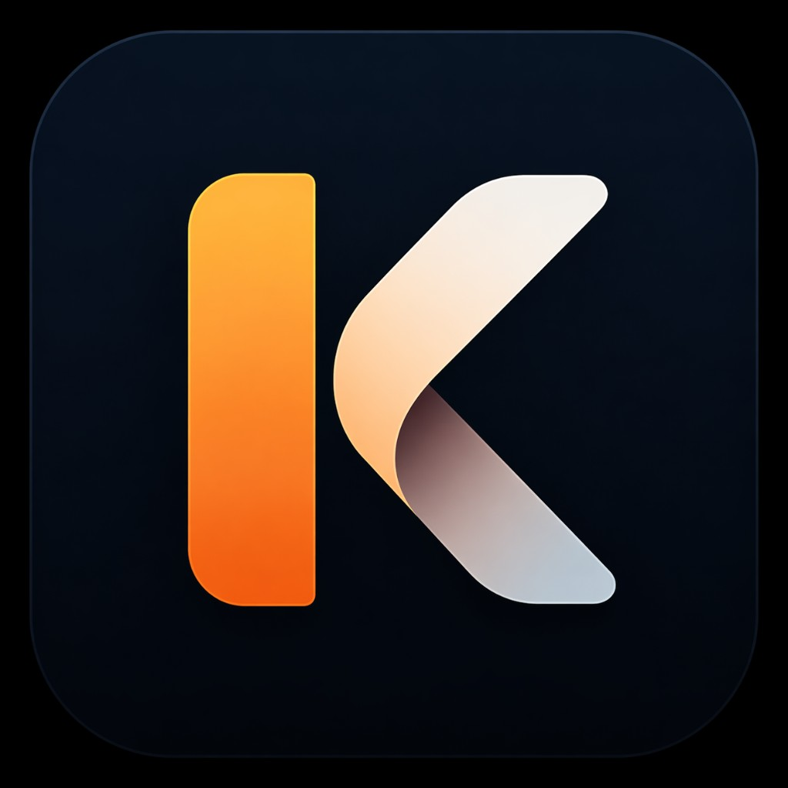

<div align="center">



# Kova — AI Financial Assistant

A mobile personal-finance coach that turns your spending, income, and goals into
calm, friendly guidance — by chat **or** by voice.

[](https://expo.dev/)
[](https://reactnative.dev/)
[](https://www.typescriptlang.org/)
[](https://supabase.com/)

</div>

---

## Overview

Kova is a cross-platform (iOS / Android) app built with **Expo + React Native** and a
**Supabase** backend. Users set savings goals, log or import transactions, and ask an
AI coach for short, supportive advice grounded in their own numbers. The coach is
available as a **text chat** and as a **hands-free voice assistant**.

The AI never runs in the client — prompts are sent to a Supabase **Edge Function**
(`coach-chat`) that calls Google Gemini server-side, so no model keys ship inside the app.

## Features

- **AI Coach (chat + voice)** — ask questions in plain language; replies are concise, calm, and tied to your real financial snapshot.
- **Voice assistant** — speak commands (e.g. "add $20 to my trip goal"); on-device speech recognition via `expo-speech-recognition`, spoken responses via `expo-speech`.
- **Goals** — create goals with targets and due dates, track progress, and see what's blocking each one.
- **Transactions** — add expenses manually or **import a bank/CSV statement**, with smart merchant → category mapping.
- **Insights** — spending breakdowns, monthly comparisons, and pattern detection.
- **Onboarding** — guided setup for income, first goal, spending weaknesses, and coach tone.
- **Secure auth & data** — Supabase Auth with Row-Level Security; users can export-style review and **delete their account** via a dedicated Edge Function.

## Tech stack

| Layer        | Tech                                                                          |
| ------------ | ----------------------------------------------------------------------------- |
| App          | Expo SDK 54, React Native 0.81, React 19, TypeScript                           |
| Navigation   | React Navigation 7 (native stack + bottom tabs)                               |
| UI / Motion  | Custom design system, Reanimated 4, `expo-linear-gradient`, `react-native-svg` |
| Voice        | `expo-speech-recognition` (STT), `expo-speech` (TTS)                          |
| Backend      | Supabase (Postgres, Auth, RLS, Edge Functions)                               |
| AI           | Google Gemini via the `coach-chat` Edge Function                              |

## Project structure

```
.
├── App.tsx                  # Provider tree (Auth → Profile → Theme → Voice → Navigation)
├── index.ts                 # Expo entry
├── src/
│   ├── components/          # Reusable UI (cards, charts, voice mic, bubbles, …)
│   ├── contexts/            # Auth, Profile, VoiceAssistant providers
│   ├── hooks/               # Data + coach hooks (useGoalsTransactions, useCoachThread, …)
│   ├── lib/                 # Supabase client, formatting, insights, voice pipeline
│   ├── navigation/          # Root navigation + floating bottom tab bar
│   ├── screens/             # Home, Goals, Insights, Coach, Transactions, Profile, Onboarding, Auth
│   ├── theme/               # Tokens, colors, typography, layout
│   └── types/               # Shared models
├── supabase/
│   ├── migrations/          # SQL schema migrations
│   ├── functions/
│   │   ├── coach-chat/      # AI coach (calls Gemini)
│   │   └── delete-account/  # Account deletion (service-role)
│   └── schema.sql           # Base schema
└── assets/                  # Icons, splash, logo
```

## Getting started

### Prerequisites

- **Node 20+** (a `.nvmrc` pins Node 22 — run `nvm use` if you use nvm)
- **Expo CLI** (used via `npx`, no global install needed)
- A **Supabase** project (free tier works) for auth, data, and the AI function
- The **Expo Go** app on your phone for quick testing, _or_ an iOS Simulator / Android Emulator

> [!NOTE]
> This app uses native modules (e.g. speech recognition). Expo Go is fine for most
> development, but a **development build** (`npx expo run:ios` / `run:android`) is
> recommended for full voice functionality on a real device.

### 1. Install dependencies

```bash
npm install
```

### 2. Configure environment

Copy the example file and fill in your Supabase project values:

```bash
cp .env.example .env
```

```bash
# .env  (never commit this file)
EXPO_PUBLIC_SUPABASE_URL=https://YOUR_PROJECT_REF.supabase.co
EXPO_PUBLIC_SUPABASE_ANON_KEY=your_anon_public_key
```

Only the **public** anon key belongs in the app. The Gemini API key is set as a
Supabase **function secret** (see backend setup), never in the client.

### 3. Start the app

```bash
npm start          # Expo dev server (press i / a / w, or scan the QR in Expo Go)

# platform shortcuts
npm run ios        # open in iOS Simulator
npm run android    # open in Android Emulator
npm run web        # run in the browser
```

That's it — sign up, complete onboarding, and start chatting with the coach.

## Backend setup (Supabase)

The app boots without a backend but needs Supabase for auth, data, and AI. Using the
[Supabase CLI](https://supabase.com/docs/guides/cli):

```bash
supabase login
supabase link --project-ref YOUR_PROJECT_REF

# apply database schema + migrations
supabase db push

# deploy the edge functions
supabase functions deploy coach-chat
supabase functions deploy delete-account
```

Then add the AI key in the dashboard:

> **Supabase Dashboard → Edge Functions → `coach-chat` → Secrets**
> `GEMINI_API_KEY = <your Google AI Studio key>`
> _(optional)_ `GEMINI_MODEL = gemini-2.5-flash`

More detail lives in [`supabase/LAUNCH_SUPABASE.md`](./supabase/LAUNCH_SUPABASE.md) and
the RLS notes in [`supabase/RLS_AUDIT.md`](./supabase/RLS_AUDIT.md).

## Environment variables

| Variable                        | Where        | Purpose                                  |
| ------------------------------- | ------------ | ---------------------------------------- |
| `EXPO_PUBLIC_SUPABASE_URL`      | App (`.env`) | Supabase project URL                     |
| `EXPO_PUBLIC_SUPABASE_ANON_KEY` | App (`.env`) | Public anon key for client SDK           |
| `GEMINI_API_KEY`                | Function secret | AI model key (server-side only)       |
| `GEMINI_MODEL` _(optional)_     | Function secret | Override model (default `gemini-2.5-flash`) |

## Scripts

| Command         | Description                          |
| --------------- | ------------------------------------ |
| `npm start`     | Start the Expo dev server            |
| `npm run ios`   | Run on iOS Simulator                 |
| `npm run android` | Run on Android Emulator            |
| `npm run web`   | Run in the browser                   |

## Architecture notes

- **Provider tree** (`App.tsx`) layers Auth → Profile → Theme → Voice → Navigation so any screen can read the session, profile, and launch the voice assistant.
- **Voice pipeline** (`src/lib/voice/`) parses spoken commands into safe, typed actions and executes them against Supabase, with a shared capture hook reused by both the Coach screen and the global mic.
- **Coach replies** are kept short and friendly both server-side (system prompt) and client-side (`condenseCoachReply`) so chat and voice stay calm and scannable.
- **No secrets in the client** — the Gemini key lives only in the Edge Function; the app ships just the public Supabase anon key.

## License

This project is for portfolio / demonstration purposes.
